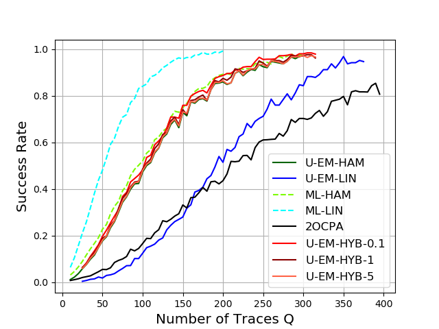
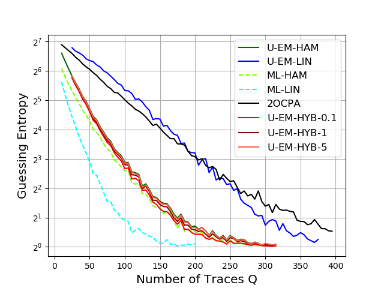

# U-EM

#### Keywords

Side Channel Analysis, Expectation-Maximization, Correlation Power Analysis, CPA, DPA

#### Presentation

This repository contains the code for the demonstration of Unprofiled Expectation Maximization Distinguisher for Side Channel Analysis. 
For more detail about the theory you can checkout the article <TO BE COMPLETED IF ACCEPTED>.

This is a joint work with 
* Julien Béguinot   (Télécom Paris, Institut Polytechnique de Paris)
* Wei Cheng         (Secure-IC S.A.S, Télécom Paris, Institut Polytechnique de Paris)
* Sylvain Guilley   (Secure-IC S.A.S, Télécom Paris, Institut Polytechnique de Paris)
* Olivier Rioul     (Télécom Paris, Institut Polytechnique de Paris).

#### Organization

  The repository is organized as follows:
  * An Interactive Python Notebook **DEMO.ipynb** demonstrate how to use the Distinguishers.
  * Figs contains figures about the performance of the distinguishers in various conditions.
  * Code DPAV4 contains code to test the distinguishers on the [DPAv4.2 Contest](https://www.dpacontest.org/v4/index.php) hosted at Télécom Paris.
  * CodeSim contains code to evaluate the distinguisher by numerical simulations.
  * DATA contains the Point of Interest already extracted from the 16 folders of the DPA Contest. There is also scripts that shows how to do it. The data to re-extract these PoIs is not present in the repository as theyr are verry heavy. Please use the [DPAv4.2 Contest](https://www.dpacontest.org/v4/index.php)  if you want to download them.

## Presentation of the distinguishers

We briefly recall how the different distinguishers presented works. For more detail refer to the article. The notations used are

* t for plaintext
* q for index of a trace
* y for a trace
* x for a sensitive variable of the model
* m for a mask
* k for the secret key
* S for the Substitution Box
* w_H for the Hamming Weight

#### Quick presentation of 2O-CPA

A state-of-the-art unsupervised attack on bivariate leakage with first-order masking is the **second-order correlation power analysis** with centered product combination on leakage of different shares . This is simply a classical CPA is applied to the centered product of the different samples. For a given key hypothesis  k , we write 

$$
\mathbf{x}(k) = (X(k)_1,\ldots,X(k)_Q)
$$

where

$$
x(k)_q = \frac{1}{2^n} \sum w_H(m) w_H(S(k \oplus t_q) \oplus m) \qquad (q=1,2,\ldots,Q).
$$

The distinguisher is then

$$
\hat{k}(\mathbf{y}) = \arg \max_{k} |\rho(\mathbf{x}(k),\widetilde{\mathbf{y}^{(1)}} \widetilde{\mathbf{y}^{(2)}})| = \arg \max_{k} |\frac{Cov (\mathbf{x}(k),\widetilde{\mathbf{y}^{(1)}} \widetilde{\mathbf{y}^{(2)}})}{\sigma_{\mathbf{x}(k)}\sigma_{\mathbf{y}^{(1)} \mathbf{y}^{(2)}}}|
$$

where $\rho$ is the empirical Pearson correlation coefficient. The guessed key is the one which is the most correlated with the leakages. CPA is well adapted for the Hamming weight leakage model, but applying it to linear leakage model  leads to a model mismatch which will be shown to limit its performance.

#### Quick presentation of Template Distinguisher

For the **maximum likelihood with templates**, we assume that the parameters a^* and b^* are known. Hence the maximum likelihood distinguisher can be directly computed from the traces.
This is unrealistic as these parameters are unknown in practice. Indeed, their knowledge requires a profiling on a identical device where the masks are also known; our attack scenario makes no such assumption. Its expression simplifies to

$$
\hat{k} = \arg \max_{k} \mathbb{P}(\mathbf{Y}=\mathbf{y}|k,a^{*},b^{*}).
$$

#### Quick presentation of the U-EM Distinguisher (Linear Case)

We briefly recall how the U-EM distinguisher works. *For more details please refer to the article.*

The EM algorithm is made up of two main steps: The **expectation step (E-Step) and the maximization step (M-Step)**. 

One iteratively

* takes the expectation over the masks given the last value of the parameters that have been computed
* maximizes the expression in the parameters to update them. 
* The algorithm stops when a given convergence criterion is achieved. 

##### The E-Step

We initialize the value of a_0 and b_0 arbitrarly, and at each iteration p build  (a_p) and (b_p) recursively using the formula

$$
a_{p+1},b_{p+1} \longleftarrow \arg \max_{a,b} \mathbb{E}_{\mathbf{M} \sim \mathcal{U}(\mathbb{F}_2^{n})^Q}{[\log(\mathbb{P}(\mathbf{Y}=\mathbf{y},\mathbf{M}|k,a,b))]}.
$$

We show in the article that it reduces to

$$
(a_{p+1},b_{p+1}) = \arg \min_{(a,b)} \sum \limits_{q} \sum \limits_{m_q} \alpha_q^{(p)}(m_q) \|y_q - x(a,b,k,t_q,m_q)\|^{2}
$$

where \alpha denotes the Bayes posterior probabily that the mask is used for a given trace.

##### The M-Step in the linear case

Let

$$
\overline{\mathbf{x}}^{(i)} = \frac{1}{Q} \sum \limits_{q,m} \alpha_{q}(m) x_{k,t_q,m}^{(i)} \in \mathbb{R}^n.
$$

The empirical autocorrelation matrix is

$$
\smash{\widehat{R{\mathbf{x}\mathbf{x}}^{(i)}}} = \sum \limits_{q,m} \alpha_{q}(m)  (x_{k,t_q,m}^{(i)} - \overline{\mathbf{x}}^{(i)}) (x_{k,t_q,m}^{(i)} - \overline{\mathbf{x}}^{(i)})^\bot \in \mathbb{R}^{n \times n}.
$$

and the empirical intercorrelation is

$$
\widehat{R_{\mathbf{x}\mathbf{y}}^{(i)}}  =  \sum \limits_{q,m} \alpha_{q}(m)  (x_{k,t_q,m}^{(i)} - \overline{\mathbf{x}}^{(i)}) y_{q}^{(i)^\bot} \in \mathbb{R}^{n }.
$$

The M-Step is given by the following rule:

$$
a^{(i)} =\bigl(\widehat{R_{\mathbf{x}\mathbf{x}}^{(i)}}\bigr)^{-1} \;\widehat{R_{\mathbf{x}\mathbf{y}}^{(i)}}
\qquad and \qquad
b^{(i)} =  - \langle a^{(i)} , \overline{\mathbf{x}}^{(i)} \rangle
$$

#####  Distinguisher

When a convergence threshold is reached then the U-EM distinguihser ranks the key by deacreasing goodness of fit with the model. That is we compute the expression of the template attack but with the computed coeficient.

#### Correlation of Sensitive Variables with the Traces of the DPAv4.2 Contest 

We can validate that the raw traces from the DPAv4.2 Contest actually leak information about the sensitive variables. This is done by computing the Pearson correlation coefficient in between the raw traces and the sensitive variables with Hamming Weight Leakage. We observe that the output of the SBox leaks aroud the time $ \approx 27 \times 10^4 $ and the masks leaks at different times e.g. $ \approx 30 \times 10^4$. 

For the PoI extraction we repectively used for the 16 folders: 

T0 = [
        270581,270581,270581,270581,
        270580,270581,270580,270580,
        270581,270580,270581,270581,
        270581,270580,270580,270580
]

T1 = [
        307824,307822,307825,307821,
        307821,307823,307824,307823,
        307824,307823,307824,307823,
        307823,307824,307823,307823
]

<object data="Figs/corrMask.pdf" type="application/pdf" width="100%">
    <embed src="Figs/corrMask.pdf">
        
This browser does not support PDFs. Please download the PDF to view it: <a href="Figs/corrMask.pdf">Download PDF</a>.

    </embed>
</object>

<object data="Figs/corrSBox.pdf" type="application/pdf" width="100%">
    <embed src="Figs/corrSBox.pdf">
        
This browser does not support PDFs. Please download the PDF to view it: <a href="Figs/corrSBox.pdf">Download PDF</a>.

    </embed>
</object>

#### Performance of the Distinguishers

We have validated the performances of the Distinguishers numerically and on the real traces from DPA Contests.

